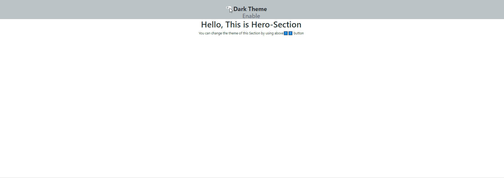

# THEME TOGGLE
 
Welcome 🙋‍♂️ !
 We all like when website have _dark mode_ option .It makes web-page easier to read and helps eyes to feel more relaxed and also saves battery.There is no magic switching between theme yet,and React makes it more easy to implement this feature.
 In Top, there is _switch_ which toggle between _white_ and _dark_ theme on a simple web page



***
## Assets
  - bootstrap switch toggler

## To Run
do git clone of the repository https://github.com/mayur-keswani/Theme-Toggle-Using-React.git. 
In the project directory, you can run: 
#### `npm start`
Runs the app in the development mode.\
Open [http://localhost:3000](http://localhost:3000) to view it in the browser.


## Purpose of this project:
- To get a Hands-on experience in Basics of React
- Anyone can use this project as a reference to design their own Business website
- Can be a good starting point for beginneres who have just started exploring React.

## Topics Covered :-
The project is made using React hooks (Functional-based): 
It covers topics like :
 1) useState  
 2) useContext 
	* provider
	* consumer
 3) Setting className dynamically
 4) Lists and Conditionals in React
  

### Need help?

```Javascript
  if (needHelp === true) {
     var emailId = "mayurkeswani2001@gmail.com";
     // email is the best way to reach out to me.
     sendEmail(emailId);
  }
```

_Glad to see you here! Show some love by starring this repo._
```Javascript
 if (isAwesome) {
    // thanks in advance 
    starThisRepository();
  }
```


